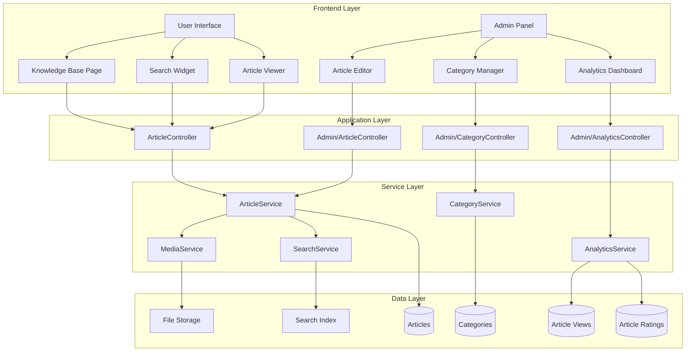

# Design Document: База знаний (Knowledge Base)

## Overview

База знаний MasterPlan - это система управления обучающим контентом, которая заменяет существующую систему подсказок (hints). Новая система предоставляет полноценные статьи с инструкциями, скриншотами и видео, организованные по категориям с возможностью поиска и управления через админ-панель.

Ключевые отличия от старой системы подсказок:
- Полноценные статьи вместо коротких всплывающих подсказок
- Поддержка Markdown, изображений и видео
- Иерархическая структура категорий
- Полнотекстовый поиск
- Управление через админ-панель
- Аналитика просмотров и рейтинги

## Architecture

### Technology Stack

**Backend:**
- Laravel 12 (PHP 8.2+)
- MySQL 8.0+ для хранения данных
- Laravel Storage для медиа-файлов
- Laravel Scout для полнотекстового поиска (driver: database)

**Frontend:**
- React 19 + TypeScript
- Inertia.js для SSR
- **shadcn/ui** - все UI компоненты (Button, Card, Dialog, Input, Textarea, Select, Badge, Tabs, etc.)
- TanStack Query для кэширования
- React Markdown для рендеринга контента
- React Player для видео
- Tailwind CSS для стилизации

**Медиа обработка:**
- Intervention Image для оптимизации изображений
- FFmpeg для обработки видео (опционально)

### System Architecture



### Database Schema

```mermaid
erDiagram
    kb_categories ||--o{ kb_categories : "parent_id"
    kb_categories ||--o{ kb_articles : "category_id"
    kb_articles ||--o{ kb_article_media : "article_id"
    kb_articles ||--o{ kb_article_views : "article_id"
    kb_articles ||--o{ kb_article_ratings : "article_id"
    kb_articles ||--o{ kb_article_versions : "article_id"
    users ||--o{ kb_article_views : "user_id"
    users ||--o{ kb_article_ratings : "user_id"
    
    kb_categories {
        bigint id PK
        string name
        string slug
        text description
        bigint parent_id FK
        string icon
        string color
        int order
        boolean is_active
        timestamps
    }
    
    kb_articles {
        bigint id PK
        bigint category_id FK
        string title
        string slug
        text content
        text excerpt
        enum status
        int view_count
        int reading_time
        boolean is_featured
        boolean is_published
        timestamp published_at
        timestamps
        softDeletes
    }
    
    kb_article_media {
        bigint id PK
        bigint article_id FK
        enum type
        string filename
        string path
        string url
        int size
        json metadata
        int order
        timestamps
    }
    
    kb_article_views {
        bigint id PK
        bigint article_id FK
        bigint user_id FK
        string ip_address
        string user_agent
        timestamp viewed_at
    }
    
    kb_article_ratings {
        bigint id PK
        bigint article_id FK
        bigint user_id FK
        boolean is_helpful
        text feedback
        timestamps
    }
    
    kb_article_versions {
        bigint id PK
        bigint article_id FK
        text content
        bigint created_by
        timestamp created_at
    }
```

## Components and Interfaces

### Backend Components

#### 1. Models

**KnowledgeBaseCategory**
```php
class KnowledgeBaseCategory extends Model
{
    protected $table = 'kb_categories';
    
    protected $fillable = [
        'name', 'slug', 'description', 'parent_id',
        'icon', 'color', 'order', 'is_active'
    ];
    
    protected $casts = [
        'is_active' => 'boolean',
        'order' => 'integer',
    ];
    
    // Relationships
    public function parent(): BelongsTo;
    public function children(): HasMany;
    public function articles(): HasMany;
    
    // Methods
    public function getFullPath(): string;
    public function getArticleCount(): int;
    public function isRoot(): bool;
}
```

**KnowledgeBaseArticle**
```php
class KnowledgeBaseArticle extends Model
{
    use SoftDeletes;
    
    protected $table = 'kb_articles';
    
    protected $fillable = [
        'category_id', 'title', 'slug', 'content', 'excerpt',
        'status', 'view_count', 'reading_time', 'is_featured',
        'is_published', 'published_at'
    ];
    
    protected $casts = [
        'is_featured' => 'boolean',
        'is_published' => 'boolean',
        'published_at' => 'datetime',
        'view_count' => 'integer',
        'reading_time' => 'integer',
    ];
    
    // Relationships
    public function category(): BelongsTo;
    public function media(): HasMany;
    public function views(): HasMany;
    public function ratings(): HasMany;
    public function versions(): HasMany;
    
    // Methods
    public function incrementViewCount(): void;
    public function calculateReadingTime(): int;
    public function getHelpfulPercentage(): float;
    public function createVersion(): void;
}
```

**KnowledgeBaseArticleMedia**
```php
class KnowledgeBaseArticleMedia extends Model
{
    protected $table = 'kb_article_media';
    
    protected $fillable = [
        'article_id', 'type', 'filename', 'path',
        'url', 'size', 'metadata', 'order'
    ];
    
    protected $casts = [
        'metadata' => 'array',
        'size' => 'integer',
        'order' => 'integer',
    ];
    
    // Relationships
    public function article(): BelongsTo;
    
    // Methods
    public function getFullUrl(): string;
    public function getThumbnailUrl(): string;
}
```

**KnowledgeBaseArticleView**
```php
class KnowledgeBaseArticleView extends Model
{
    protected $table = 'kb_article_views';
    
    public $timestamps = false;
    
    protected $fillable = [
        'article_id', 'user_id', 'ip_address',
        'user_agent', 'viewed_at'
    ];
    
    protected $casts = [
        'viewed_at' => 'datetime',
    ];
    
    // Relationships
    public function article(): BelongsTo;
    public function user(): BelongsTo;
}
```

**KnowledgeBaseArticleRating**
```php
class KnowledgeBaseArticleRating extends Model
{
    protected $table = 'kb_article_ratings';
    
    protected $fillable = [
        'article_id', 'user_id', 'is_helpful', 'feedback'
    ];
    
    protected $casts = [
        'is_helpful' => 'boolean',
    ];
    
    // Relationships
    public function article(): BelongsTo;
    public function user(): BelongsTo;
}
```

#### 2. Services

**ArticleService**
```php
class ArticleService
{
    public function __construct(
        private MediaService $mediaService,
        private SearchService $searchService
    ) {}
    
    public function create(array $data): KnowledgeBaseArticle;
    public function update(KnowledgeBaseArticle $article, array $data): KnowledgeBaseArticle;
    public function delete(KnowledgeBaseArticle $article): bool;
    public function publish(KnowledgeBaseArticle $article): bool;
    public function unpublish(KnowledgeBaseArticle $article): bool;
    public function recordView(KnowledgeBaseArticle $article, ?User $user, Request $request): void;
    public function rateArticle(KnowledgeBaseArticle $article, User $user, bool $isHelpful, ?string $feedback): void;
    public function getRelatedArticles(KnowledgeBaseArticle $article, int $limit = 5): Collection;
    public function getPopularArticles(int $limit = 10): Collection;
    public function getFeaturedArticles(): Collection;
}
```

**CategoryService**
```php
class CategoryService
{
    public function create(array $data): KnowledgeBaseCategory;
    public function update(KnowledgeBaseCategory $category, array $data): KnowledgeBaseCategory;
    public function delete(KnowledgeBaseCategory $category): bool;
    public function reorder(array $order): void;
    public function getTree(): Collection;
    public function getBreadcrumbs(KnowledgeBaseCategory $category): array;
}
```

**MediaService**
```php
class MediaService
{
    public function uploadImage(UploadedFile $file, KnowledgeBaseArticle $article): KnowledgeBaseArticleMedia;
    public function uploadVideo(UploadedFile $file, KnowledgeBaseArticle $article): KnowledgeBaseArticleMedia;
    public function createVideoEmbed(string $url, KnowledgeBaseArticle $article): KnowledgeBaseArticleMedia;
    public function deleteMedia(KnowledgeBaseArticleMedia $media): bool;
    public function optimizeImage(string $path): void;
    public function generateThumbnail(string $path): string;
}
```

**SearchService**
```php
class SearchService
{
    public function search(string $query, ?int $categoryId = null): Collection;
    public function indexArticle(KnowledgeBaseArticle $article): void;
    public function removeFromIndex(KnowledgeBaseArticle $article): void;
    public function getPopularSearches(int $limit = 10): array;
    public function trackSearch(string $query, int $resultsCount): void;
}
```

**AnalyticsService**
```php
class AnalyticsService
{
    public function getArticleStats(KnowledgeBaseArticle $article): array;
    public function getCategoryStats(KnowledgeBaseCategory $category): array;
    public function getOverallStats(): array;
    public function getViewsByPeriod(string $period = 'day'): array;
    public function getTopArticles(int $limit = 10): Collection;
    public function getLowRatedArticles(float $threshold = 0.5): Collection;
}
```

#### 3. Controllers

**App/KnowledgeBaseController** (для пользователей)
```php
class KnowledgeBaseController extends Controller
{
    public function index(Request $request): Response;
    public function show(string $slug): Response;
    public function search(Request $request): JsonResponse;
    public function rate(KnowledgeBaseArticle $article, Request $request): JsonResponse;
}
```

**Admin/KnowledgeBaseArticleController** (для админов)
```php
class KnowledgeBaseArticleController extends Controller
{
    public function index(Request $request): Response;
    public function create(): Response;
    public function store(Request $request): RedirectResponse;
    public function edit(KnowledgeBaseArticle $article): Response;
    public function update(Request $request, KnowledgeBaseArticle $article): RedirectResponse;
    public function destroy(KnowledgeBaseArticle $article): RedirectResponse;
    public function publish(KnowledgeBaseArticle $article): JsonResponse;
    public function unpublish(KnowledgeBaseArticle $article): JsonResponse;
    public function uploadMedia(Request $request, KnowledgeBaseArticle $article): JsonResponse;
    public function deleteMedia(KnowledgeBaseArticleMedia $media): JsonResponse;
}
```

**Admin/KnowledgeBaseCategoryController**
```php
class KnowledgeBaseCategoryController extends Controller
{
    public function index(): Response;
    public function store(Request $request): JsonResponse;
    public function update(Request $request, KnowledgeBaseCategory $category): JsonResponse;
    public function destroy(KnowledgeBaseCategory $category): JsonResponse;
    public function reorder(Request $request): JsonResponse;
}
```

**Admin/KnowledgeBaseAnalyticsController**
```php
class KnowledgeBaseAnalyticsController extends Controller
{
    public function index(): Response;
    public function article(KnowledgeBaseArticle $article): JsonResponse;
    public function export(Request $request): BinaryFileResponse;
}
```

### Frontend Components

#### User-Facing Components

**Все компоненты используют shadcn/ui библиотеку для UI элементов**

**KnowledgeBasePage** - главная страница базы знаний
```typescript
// Использует: Card, Badge, Button, Input (для поиска)
interface KnowledgeBasePageProps {
  categories: Category[];
  featuredArticles: Article[];
  popularArticles: Article[];
}

export function KnowledgeBasePage(props: KnowledgeBasePageProps): JSX.Element;
```

**ArticleViewer** - просмотр статьи
```typescript
// Использует: Card, Badge, Separator, ScrollArea
interface ArticleViewerProps {
  article: Article;
  relatedArticles: Article[];
}

export function ArticleViewer(props: ArticleViewerProps): JSX.Element;
```

**SearchWidget** - виджет поиска
```typescript
// Использует: Input, Button, Command (для автодополнения)
interface SearchWidgetProps {
  placeholder?: string;
  onSearch?: (query: string) => void;
}

export function SearchWidget(props: SearchWidgetProps): JSX.Element;
```

**CategoryTree** - дерево категорий
```typescript
// Использует: Accordion, Badge, Button
interface CategoryTreeProps {
  categories: Category[];
  selectedId?: number;
  onSelect?: (category: Category) => void;
}

export function CategoryTree(props: CategoryTreeProps): JSX.Element;
```

**ArticleRating** - рейтинг статьи
```typescript
// Использует: Button, Textarea, Dialog, Badge
interface ArticleRatingProps {
  articleId: number;
  currentRating?: boolean;
  onRate: (isHelpful: boolean, feedback?: string) => void;
}

export function ArticleRating(props: ArticleRatingProps): JSX.Element;
```

#### Admin Components

**Все админские компоненты используют shadcn/ui библиотеку**

**ArticleEditor** - редактор статей
```typescript
// Использует: Card, Input, Select, Textarea, Button, Tabs, Switch, Badge
interface ArticleEditorProps {
  article?: Article;
  categories: Category[];
  onSave: (data: ArticleFormData) => void;
}

export function ArticleEditor(props: ArticleEditorProps): JSX.Element;
```

**MarkdownEditor** - редактор Markdown с превью
```typescript
// Использует: Tabs, Textarea, Button, Card
interface MarkdownEditorProps {
  value: string;
  onChange: (value: string) => void;
  onUploadImage: (file: File) => Promise<string>;
}

export function MarkdownEditor(props: MarkdownEditorProps): JSX.Element;
```

**MediaUploader** - загрузчик медиа
```typescript
// Использует: Card, Button, Progress, Dialog, Badge
interface MediaUploaderProps {
  articleId: number;
  media: Media[];
  onUpload: (file: File) => Promise<void>;
  onDelete: (mediaId: number) => Promise<void>;
}

export function MediaUploader(props: MediaUploaderProps): JSX.Element;
```

**CategoryManager** - управление категориями
```typescript
// Использует: Dialog, Input, Select, Button, Table, Badge
interface CategoryManagerProps {
  categories: Category[];
  onCreate: (data: CategoryFormData) => void;
  onUpdate: (id: number, data: CategoryFormData) => void;
  onDelete: (id: number) => void;
  onReorder: (order: number[]) => void;
}

export function CategoryManager(props: CategoryManagerProps): JSX.Element;
```

**AnalyticsDashboard** - дашборд аналитики
```typescript
// Использует: Card, Tabs, Table, Badge, Select (для фильтров)
interface AnalyticsDashboardProps {
  stats: OverallStats;
  topArticles: Article[];
  viewsChart: ChartData;
}

export function AnalyticsDashboard(props: AnalyticsDashboardProps): JSX.Element;
```

## Data Models

### TypeScript Interfaces

```typescript
interface Category {
  id: number;
  name: string;
  slug: string;
  description?: string;
  parent_id?: number;
  icon?: string;
  color?: string;
  order: number;
  is_active: boolean;
  children?: Category[];
  article_count?: number;
  created_at: string;
  updated_at: string;
}

interface Article {
  id: number;
  category_id: number;
  category?: Category;
  title: string;
  slug: string;
  content: string;
  excerpt?: string;
  status: 'draft' | 'published';
  view_count: number;
  reading_time: number;
  is_featured: boolean;
  is_published: boolean;
  published_at?: string;
  media?: Media[];
  helpful_percentage?: number;
  created_at: string;
  updated_at: string;
}

interface Media {
  id: number;
  article_id: number;
  type: 'image' | 'video' | 'video_embed';
  filename: string;
  path: string;
  url: string;
  thumbnail_url?: string;
  size: number;
  metadata?: {
    width?: number;
    height?: number;
    duration?: number;
    provider?: 'youtube' | 'vimeo';
    embed_id?: string;
  };
  order: number;
  created_at: string;
  updated_at: string;
}

interface ArticleView {
  id: number;
  article_id: number;
  user_id?: number;
  ip_address: string;
  user_agent: string;
  viewed_at: string;
}

interface ArticleRating {
  id: number;
  article_id: number;
  user_id: number;
  is_helpful: boolean;
  feedback?: string;
  created_at: string;
  updated_at: string;
}

interface ArticleVersion {
  id: number;
  article_id: number;
  content: string;
  created_by: number;
  created_at: string;
}

interface SearchResult {
  articles: Article[];
  total: number;
  query: string;
  highlights: Record<number, string[]>;
}

interface OverallStats {
  total_articles: number;
  total_views: number;
  total_ratings: number;
  average_helpful_percentage: number;
  views_today: number;
  views_this_week: number;
  views_this_month: number;
}
```

## Correctness Properties

*A property is a characteristic or behavior that should hold true across all valid executions of a system-essentially, a formal statement about what the system should do. Properties serve as the bridge between human-readable specifications and machine-verifiable correctness guarantees.*

### Acceptance Criteria Testing Prework

1.1 THE Knowledge_Base SHALL support hierarchical category structure
  Thoughts: This is about the data structure supporting parent-child relationships. We can test this by creating categories with parent relationships and verifying the tree structure is maintained correctly.
  Testable: yes - property

1.2 WHEN creating a category, THE System SHALL require a name and optional parent category
  Thoughts: This is input validation. We can test with various inputs including missing names, valid names, and different parent_id values.
  Testable: yes - property

1.3 THE System SHALL allow unlimited nesting depth for categories
  Thoughts: This tests that we can create deeply nested categories without artificial limits. We can generate random category trees of varying depths.
  Testable: yes - property

1.4 WHEN displaying categories, THE System SHALL show them in tree structure
  Thoughts: This is about the output format. We can test that the API/service returns categories in a hierarchical structure.
  Testable: yes - property

2.1 WHEN creating an article, THE Admin_Panel SHALL require title, category, and content
  Thoughts: This is input validation for article creation. We can test with missing required fields.
  Testable: yes - property

2.2 THE System SHALL support Markdown formatting for article content
  Thoughts: This tests that Markdown content is properly stored and rendered. We can test with various Markdown syntax.
  Testable: yes - property

2.5 WHEN saving an article, THE System SHALL validate all required fields
  Thoughts: This is comprehensive input validation. We can test with various invalid inputs.
  Testable: yes - property

2.7 THE System SHALL track article creation and modification dates
  Thoughts: This tests that timestamps are properly maintained. We can verify created_at and updated_at are set correctly.
  Testable: yes - property

3.1 THE System SHALL support image uploads (JPG, PNG, WebP, max 5MB)
  Thoughts: This tests file upload validation. We can test with various file types and sizes.
  Testable: yes - property

3.6 WHEN uploading media, THE System SHALL validate file types and sizes
  Thoughts: This is input validation for media uploads. We can test with invalid file types and oversized files.
  Testable: yes - property

4.1 THE Knowledge_Base SHALL provide full-text search across all articles
  Thoughts: This tests search functionality. We can create articles with known content and verify search finds them.
  Testable: yes - property

4.6 THE System SHALL track popular articles based on view count
  Thoughts: This tests that view counts are properly incremented and articles can be sorted by popularity.
  Testable: yes - property

5.1 THE System SHALL render Markdown content as formatted HTML
  Thoughts: This is a round-trip property - Markdown input should produce valid HTML output.
  Testable: yes - property

5.5 THE System SHALL track article views for analytics
  Thoughts: This tests that views are recorded. We can verify view count increments correctly.
  Testable: yes - property

5.6 THE System SHALL show estimated reading time for each article
  Thoughts: This tests the reading time calculation. We can verify it's calculated based on word count.
  Testable: yes - property

9.1 THE System SHALL save article history on each update
  Thoughts: This tests versioning. We can update an article and verify a version is created.
  Testable: yes - property

9.4 THE System SHALL support restoring previous versions
  Thoughts: This is a round-trip property - save version, restore it, content should match.
  Testable: yes - property

### Property Reflection

After reviewing all testable properties, I identify the following consolidations:

- Properties 2.1 and 2.5 both test input validation for articles - can be combined into one comprehensive validation property
- Properties 3.1 and 3.6 both test media upload validation - can be combined
- Properties 5.5 and 4.6 both test view tracking - can be combined into one property about view count accuracy

### Correctness Properties

**Property 1: Category hierarchy integrity**
*For any* set of categories with parent-child relationships, the tree structure should be acyclic and all parent references should point to existing categories.
**Validates: Requirements 1.1, 1.3, 1.4**

**Property 2: Category creation validation**
*For any* category creation attempt, the system should reject requests missing a name and accept requests with valid names and optional parent_id values.
**Validates: Requirements 1.2**

**Property 3: Article creation and update validation**
*For any* article creation or update attempt, the system should reject requests missing required fields (title, category_id, content) and accept valid requests with all required fields.
**Validates: Requirements 2.1, 2.5**

**Property 4: Markdown round-trip consistency**
*For any* valid Markdown content, storing it in an article and retrieving it should produce equivalent content, and rendering it should produce valid HTML.
**Validates: Requirements 2.2, 5.1**

**Property 5: Timestamp tracking accuracy**
*For any* article, the created_at timestamp should be set on creation and never change, while updated_at should be updated on every modification.
**Validates: Requirements 2.7**

**Property 6: Media upload validation**
*For any* file upload attempt, the system should reject files with invalid types or sizes exceeding limits (images > 5MB, videos > 50MB) and accept valid files within limits.
**Validates: Requirements 3.1, 3.6**

**Property 7: Search completeness**
*For any* article with published status, searching for words from its title or content should return that article in the results.
**Validates: Requirements 4.1**

**Property 8: View count accuracy**
*For any* article, each view should increment the view_count by exactly 1, and popular articles should be those with the highest view counts.
**Validates: Requirements 4.6, 5.5**

**Property 9: Reading time calculation**
*For any* article, the reading time should be calculated as (word_count / 200) rounded up to the nearest minute, where 200 is the average reading speed in words per minute.
**Validates: Requirements 5.6**

**Property 10: Version history completeness**
*For any* article update, a new version should be created containing the previous content, and restoring a version should set the article content to match that version exactly.
**Validates: Requirements 9.1, 9.4**

## Error Handling

### Validation Errors

**Category Validation:**
- Missing name: Return 422 with message "Category name is required"
- Invalid parent_id: Return 422 with message "Parent category does not exist"
- Circular reference: Return 422 with message "Cannot set category as its own parent"
- Duplicate slug: Return 422 with message "Category slug already exists"

**Article Validation:**
- Missing required fields: Return 422 with field-specific messages
- Invalid category_id: Return 422 with message "Category does not exist"
- Duplicate slug: Return 422 with message "Article slug already exists"
- Invalid status: Return 422 with message "Status must be draft or published"

**Media Validation:**
- Invalid file type: Return 422 with message "File type not supported. Allowed: JPG, PNG, WebP for images; MP4 for videos"
- File too large: Return 422 with message "File size exceeds limit. Max: 5MB for images, 50MB for videos"
- Upload failed: Return 500 with message "Failed to upload file. Please try again"

### Runtime Errors

**Database Errors:**
- Connection failed: Log error, return 500 with message "Database connection failed"
- Query failed: Log error, return 500 with message "Failed to process request"
- Constraint violation: Return 422 with appropriate message

**File System Errors:**
- Storage full: Log error, return 500 with message "Storage space unavailable"
- Permission denied: Log error, return 500 with message "File system permission error"
- File not found: Return 404 with message "Media file not found"

**Search Errors:**
- Search service unavailable: Log error, fallback to basic database search
- Invalid query: Return 422 with message "Invalid search query"

### User-Facing Error Messages

All error messages should be:
- Clear and actionable
- Localized (Russian for this project)
- Logged for debugging (with stack traces in development)
- Sanitized (no sensitive information exposed)

## Testing Strategy

### Dual Testing Approach

The system will use both unit tests and property-based tests for comprehensive coverage:

**Unit Tests** focus on:
- Specific examples of valid and invalid inputs
- Edge cases (empty strings, null values, boundary conditions)
- Integration between components
- Error conditions and exception handling

**Property-Based Tests** focus on:
- Universal properties that hold for all inputs
- Comprehensive input coverage through randomization
- Invariants that must be maintained
- Round-trip properties (serialize/deserialize, save/restore)

### Property-Based Testing Configuration

**Framework:** PHPUnit with Eris (property-based testing library for PHP)

**Configuration:**
- Minimum 100 iterations per property test
- Each test tagged with format: **Feature: knowledge-base, Property {number}: {property_text}**
- Generators for: categories, articles, media files, search queries
- Shrinking enabled to find minimal failing examples

**Test Organization:**
```
tests/
├── Unit/
│   ├── Models/
│   │   ├── KnowledgeBaseCategoryTest.php
│   │   ├── KnowledgeBaseArticleTest.php
│   │   └── KnowledgeBaseArticleMediaTest.php
│   ├── Services/
│   │   ├── ArticleServiceTest.php
│   │   ├── CategoryServiceTest.php
│   │   ├── MediaServiceTest.php
│   │   └── SearchServiceTest.php
│   └── Controllers/
│       ├── KnowledgeBaseControllerTest.php
│       └── Admin/
│           ├── KnowledgeBaseArticleControllerTest.php
│           └── KnowledgeBaseCategoryControllerTest.php
└── Property/
    ├── CategoryHierarchyTest.php
    ├── ArticleValidationTest.php
    ├── MarkdownRoundTripTest.php
    ├── MediaValidationTest.php
    ├── SearchCompletenessTest.php
    ├── ViewCountAccuracyTest.php
    └── VersionHistoryTest.php
```

### Frontend Testing

**Framework:** Vitest + React Testing Library

**Test Types:**
- Component unit tests for UI components
- Integration tests for user flows
- Accessibility tests (a11y compliance)
- Visual regression tests (optional)

**Coverage Goals:**
- Backend: 80%+ code coverage
- Frontend: 70%+ code coverage
- All correctness properties: 100% coverage

### Manual Testing Checklist

Before release, manually verify:
- [ ] Article creation and editing workflow
- [ ] Media upload and display
- [ ] Search functionality
- [ ] Category management
- [ ] Analytics dashboard
- [ ] Mobile responsiveness
- [ ] Accessibility (keyboard navigation, screen readers)
- [ ] Performance (page load times, search speed)
