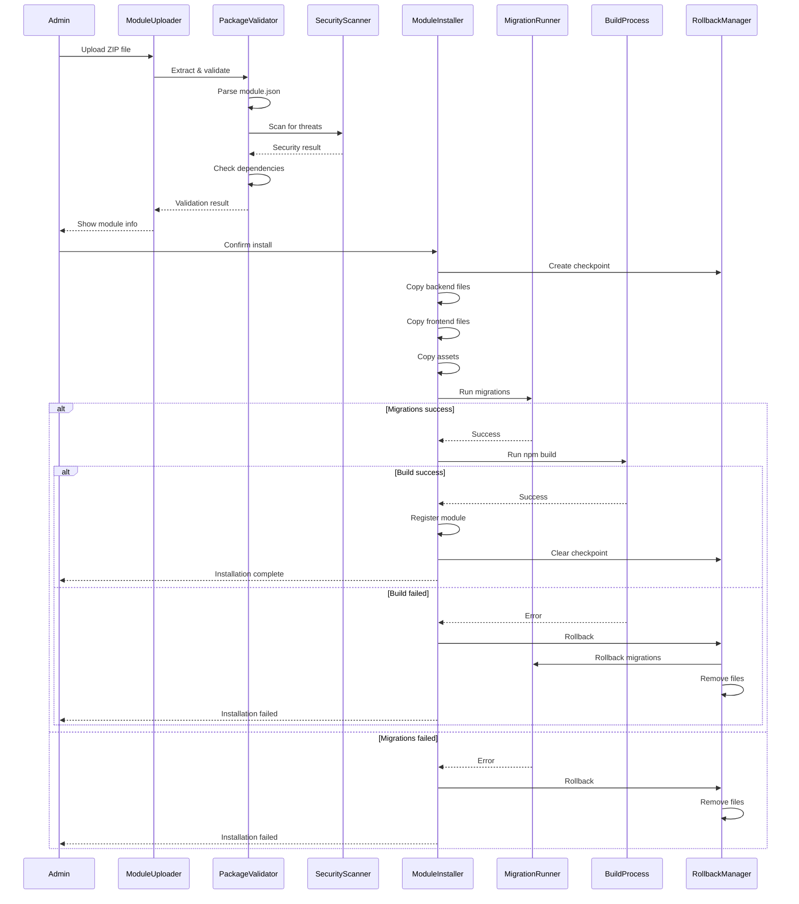
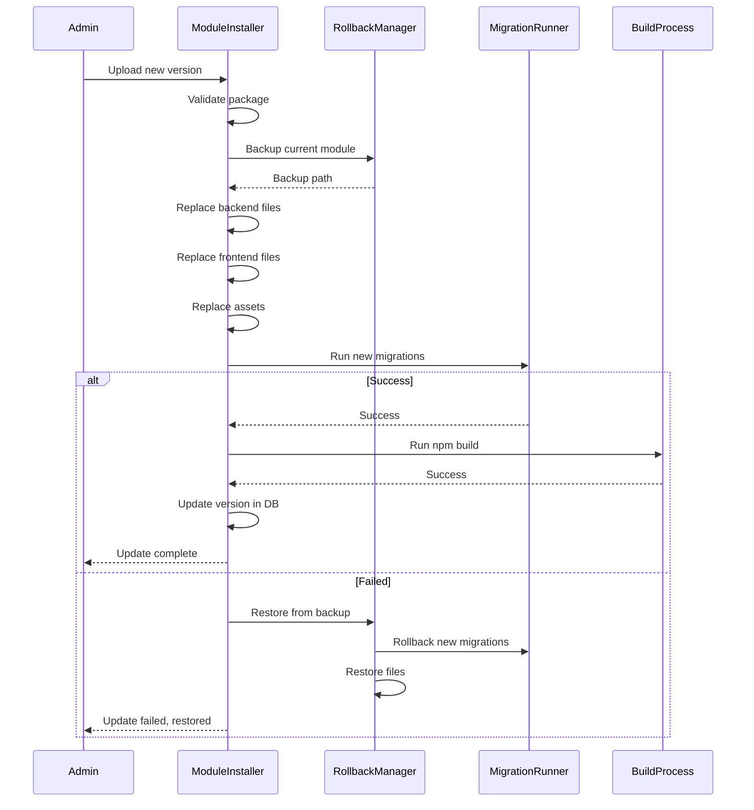
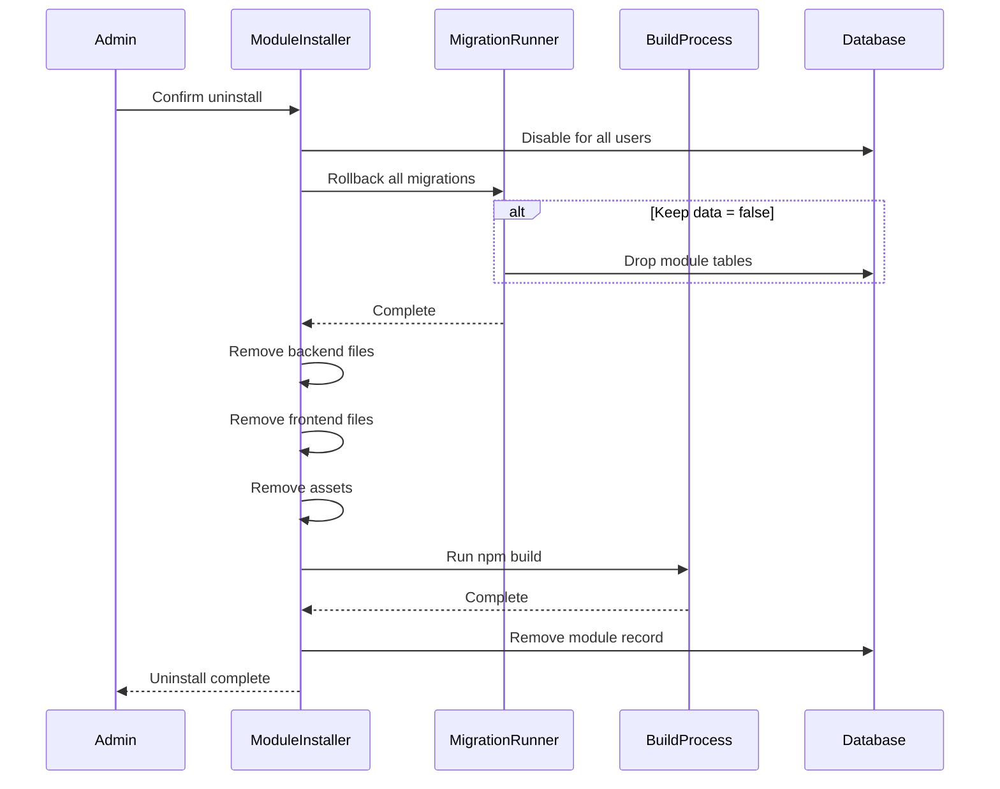

# Design Document: Система установки модулей через админку

## Overview

Система установки модулей позволяет администратору CRM загружать, устанавливать, обновлять и удалять модули через веб-интерфейс без ручного копирования файлов. Система включает мастер первоначальной установки CRM и полный lifecycle management модулей.

### Ключевые принципы:
- **Транзакционность** — все операции атомарны с возможностью отката
- **Безопасность** — валидация пакетов, проверка на вредоносный код
- **Автоматизация** — миграции и билд выполняются автоматически
- **Прозрачность** — детальное логирование всех операций

## Architecture

```
┌─────────────────────────────────────────────────────────────────────────┐
│                         Admin Panel (React)                              │
│  ┌─────────────────┐  ┌─────────────────┐  ┌─────────────────┐         │
│  │ InstallWizard   │  │ ModuleUploader  │  │ ModuleManager   │         │
│  └─────────────────┘  └─────────────────┘  └─────────────────┘         │
└─────────────────────────────────────────────────────────────────────────┘
                                    │
                                    ▼
┌─────────────────────────────────────────────────────────────────────────┐
│                         API Layer (Laravel)                              │
│  ┌─────────────────┐  ┌─────────────────┐  ┌─────────────────┐         │
│  │ InstallController│  │ ModuleController│  │ WebSocket/SSE   │         │
│  └─────────────────┘  └─────────────────┘  └─────────────────┘         │
└─────────────────────────────────────────────────────────────────────────┘
                                    │
                                    ▼
┌─────────────────────────────────────────────────────────────────────────┐
│                       Service Layer                                      │
│  ┌──────────────┐  ┌──────────────┐  ┌──────────────┐  ┌──────────────┐│
│  │ Installation │  │   Module     │  │   Build      │  │   Rollback   ││
│  │   Wizard     │  │  Installer   │  │   Process    │  │   Manager    ││
│  └──────────────┘  └──────────────┘  └──────────────┘  └──────────────┘│
│  ┌──────────────┐  ┌──────────────┐  ┌──────────────┐  ┌──────────────┐│
│  │   Package    │  │  Migration   │  │  Dependency  │  │   Security   ││
│  │  Validator   │  │   Runner     │  │   Resolver   │  │   Scanner    ││
│  └──────────────┘  └──────────────┘  └──────────────┘  └──────────────┘│
└─────────────────────────────────────────────────────────────────────────┘
                                    │
                                    ▼
┌─────────────────────────────────────────────────────────────────────────┐
│                       File System                                        │
│  ┌──────────────┐  ┌──────────────┐  ┌──────────────┐  ┌──────────────┐│
│  │ app/Modules/ │  │resources/js/ │  │   public/    │  │   storage/   ││
│  │              │  │  modules/    │  │   modules/   │  │   backups/   ││
│  └──────────────┘  └──────────────┘  └──────────────┘  └──────────────┘│
└─────────────────────────────────────────────────────────────────────────┘
```

## Components and Interfaces

### Backend Components

#### 1. InstallationWizardService
Сервис мастера первоначальной установки CRM.

```php
interface InstallationWizardServiceInterface
{
    // Проверка установлена ли CRM
    public function isInstalled(): bool;
    
    // Проверка системных требований
    public function checkRequirements(): RequirementsCheckResult;
    
    // Тестирование подключения к БД
    public function testDatabaseConnection(array $config): ConnectionTestResult;
    
    // Запись конфигурации в .env
    public function writeEnvConfig(array $config): bool;
    
    // Выполнение миграций
    public function runMigrations(): MigrationResult;
    
    // Создание администратора
    public function createAdministrator(array $data): Administrator;
    
    // Завершение установки
    public function completeInstallation(): void;
}
```

#### 2. ModulePackageValidator
Валидатор ZIP-пакетов модулей.

```php
interface ModulePackageValidatorInterface
{
    // Распаковка архива во временную директорию
    public function extract(UploadedFile $file): string;
    
    // Валидация структуры пакета
    public function validateStructure(string $extractedPath): ValidationResult;
    
    // Парсинг и валидация module.json
    public function parseManifest(string $extractedPath): ModuleManifest;
    
    // Проверка безопасности файлов
    public function scanForThreats(string $extractedPath): SecurityScanResult;
    
    // Проверка зависимостей
    public function checkDependencies(ModuleManifest $manifest): DependencyCheckResult;
    
    // Очистка временных файлов
    public function cleanup(string $extractedPath): void;
}
```

#### 3. ModuleInstallerService
Основной сервис установки/обновления/удаления модулей.

```php
interface ModuleInstallerServiceInterface
{
    // Установка нового модуля
    public function install(string $extractedPath, ModuleManifest $manifest): InstallationResult;
    
    // Обновление существующего модуля
    public function update(string $extractedPath, ModuleManifest $manifest): UpdateResult;
    
    // Удаление модуля
    public function uninstall(string $moduleSlug, bool $keepData = false): UninstallResult;
    
    // Получение статуса установки
    public function getInstallationStatus(string $operationId): InstallationStatus;
    
    // Отмена текущей операции
    public function cancelOperation(string $operationId): bool;
}
```

#### 4. MigrationRunnerService
Сервис выполнения миграций модулей.

```php
interface MigrationRunnerServiceInterface
{
    // Выполнение миграций модуля
    public function runModuleMigrations(string $moduleSlug, string $migrationsPath): MigrationResult;
    
    // Откат миграций модуля
    public function rollbackModuleMigrations(string $moduleSlug): MigrationResult;
    
    // Получение списка выполненных миграций
    public function getExecutedMigrations(string $moduleSlug): array;
    
    // Получение списка pending миграций
    public function getPendingMigrations(string $moduleSlug, string $migrationsPath): array;
}
```

#### 5. BuildProcessService
Сервис компиляции frontend ассетов.

```php
interface BuildProcessServiceInterface
{
    // Запуск билда
    public function runBuild(): BuildResult;
    
    // Получение статуса билда
    public function getBuildStatus(): BuildStatus;
    
    // Проверка доступности Node.js и npm
    public function checkNodeAvailability(): NodeCheckResult;
    
    // Очистка кэша
    public function clearCache(): void;
    
    // Получение вывода консоли
    public function getConsoleOutput(): string;
}
```

#### 6. RollbackManagerService
Сервис отката изменений при ошибках.

```php
interface RollbackManagerServiceInterface
{
    // Создание точки восстановления
    public function createCheckpoint(string $operationId): Checkpoint;
    
    // Откат к точке восстановления
    public function rollbackToCheckpoint(string $operationId): RollbackResult;
    
    // Создание резервной копии модуля
    public function backupModule(string $moduleSlug): string;
    
    // Восстановление модуля из резервной копии
    public function restoreModule(string $moduleSlug, string $backupPath): bool;
    
    // Очистка старых резервных копий
    public function cleanupOldBackups(int $daysToKeep = 7): int;
}
```

#### 7. SecurityScannerService
Сервис проверки безопасности пакетов.

```php
interface SecurityScannerServiceInterface
{
    // Проверка на path traversal
    public function checkPathTraversal(string $extractedPath): bool;
    
    // Проверка расположения PHP файлов
    public function validatePhpFileLocations(string $extractedPath): ValidationResult;
    
    // Проверка на опасные расширения
    public function checkDangerousExtensions(string $extractedPath): array;
    
    // Проверка ServiceProvider
    public function validateServiceProvider(string $providerPath): bool;
    
    // Полное сканирование пакета
    public function fullScan(string $extractedPath): SecurityScanResult;
}
```

#### 8. InstallationLogService
Сервис логирования операций установки.

```php
interface InstallationLogServiceInterface
{
    // Создание записи об операции
    public function createOperation(string $type, string $moduleSlug, int $adminId): InstallationLog;
    
    // Добавление шага к операции
    public function addStep(int $logId, string $step, string $status, ?string $message = null): void;
    
    // Завершение операции
    public function completeOperation(int $logId, string $status): void;
    
    // Получение логов модуля
    public function getModuleLogs(string $moduleSlug, int $limit = 50): Collection;
    
    // Получение последних операций
    public function getRecentOperations(int $limit = 20): Collection;
}
```

### Data Transfer Objects (DTOs)

```php
// Результат проверки требований
class RequirementsCheckResult
{
    public bool $passed;
    public array $requirements; // ['php' => ['required' => '8.1', 'current' => '8.2', 'passed' => true], ...]
    public array $missing;      // Список отсутствующих компонентов
}

// Результат валидации пакета
class ValidationResult
{
    public bool $valid;
    public array $errors;
    public array $warnings;
}

// Результат сканирования безопасности
class SecurityScanResult
{
    public bool $safe;
    public array $threats;      // Найденные угрозы
    public array $warnings;     // Предупреждения
}

// Результат проверки зависимостей
class DependencyCheckResult
{
    public bool $satisfied;
    public array $missing;      // Отсутствующие модули
    public array $incompatible; // Несовместимые версии
}

// Статус установки
class InstallationStatus
{
    public string $operationId;
    public string $status;      // pending, in_progress, completed, failed, cancelled
    public string $currentStep;
    public int $progress;       // 0-100
    public array $steps;        // Выполненные шаги
    public ?string $error;
}

// Результат билда
class BuildResult
{
    public bool $success;
    public string $output;
    public int $duration;       // секунды
    public ?string $error;
}
```

### Frontend Components (React + shadcn/ui)

#### 1. InstallationWizard
Мастер первоначальной установки CRM.

```typescript
// Шаги мастера установки
type WizardStep = 'welcome' | 'requirements' | 'database' | 'admin' | 'complete';

interface InstallationWizardProps {
  // Компонент не принимает props, работает автономно
}

// Используемые shadcn компоненты:
// - Card, CardHeader, CardContent, CardFooter
// - Button
// - Input, Label
// - Alert, AlertDescription
// - Progress
// - Badge (статус требований)
// - Stepper (кастомный на базе shadcn)
```

#### 2. ModuleUploader
Компонент загрузки ZIP-пакета модуля.

```typescript
interface ModuleUploaderProps {
  onUploadComplete: (result: UploadResult) => void;
  onError: (error: string) => void;
}

interface UploadResult {
  tempPath: string;
  manifest: ModuleManifest;
  validation: ValidationResult;
  security: SecurityScanResult;
  dependencies: DependencyCheckResult;
  isUpdate: boolean;
  currentVersion?: string;
}

// Используемые shadcn компоненты:
// - Card
// - Button
// - Progress
// - Alert
// - Badge
// Drag-and-drop зона с react-dropzone
```

#### 3. ModuleInstallDialog
Диалог подтверждения и процесса установки.

```typescript
interface ModuleInstallDialogProps {
  open: boolean;
  onOpenChange: (open: boolean) => void;
  uploadResult: UploadResult;
  onInstallComplete: () => void;
}

// Используемые shadcn компоненты:
// - Dialog, DialogContent, DialogHeader, DialogFooter
// - Button
// - Progress
// - ScrollArea (для логов)
// - Badge (статус шагов)
// - Alert
```

#### 4. ModuleManagerPage
Страница управления модулями в админке.

```typescript
interface ModuleManagerPageProps {
  modules: InstalledModule[];
  stats: ModuleStats;
}

interface InstalledModule {
  slug: string;
  name: string;
  version: string;
  description: string;
  isActive: boolean;
  installedAt: string;
  updatedAt: string;
  usersCount: number;
  hasUpdate?: boolean;
  latestVersion?: string;
}

// Используемые shadcn компоненты:
// - Card
// - Table, TableHeader, TableBody, TableRow, TableCell
// - Badge
// - Button
// - DropdownMenu
// - Switch (вкл/выкл)
// - Tabs (установленные / доступные обновления)
```

#### 5. ModuleDetailsSheet
Боковая панель с детальной информацией о модуле.

```typescript
interface ModuleDetailsSheetProps {
  module: InstalledModule;
  open: boolean;
  onOpenChange: (open: boolean) => void;
  onUpdate: () => void;
  onUninstall: () => void;
}

// Используемые shadcn компоненты:
// - Sheet, SheetContent, SheetHeader
// - Tabs, TabsList, TabsTrigger, TabsContent
// - Badge
// - Button
// - ScrollArea
// - Separator
```

#### 6. InstallationProgress
Компонент отображения прогресса установки в реальном времени.

```typescript
interface InstallationProgressProps {
  operationId: string;
  onComplete: (result: InstallationResult) => void;
  onError: (error: string) => void;
}

interface InstallationStep {
  id: string;
  name: string;
  status: 'pending' | 'in_progress' | 'completed' | 'failed';
  message?: string;
  duration?: number;
}

// Используемые shadcn компоненты:
// - Card
// - Progress
// - Badge
// - ScrollArea (консольный вывод)
// - Button (отмена)
```

#### 7. UninstallConfirmDialog
Диалог подтверждения удаления модуля.

```typescript
interface UninstallConfirmDialogProps {
  module: InstalledModule;
  open: boolean;
  onOpenChange: (open: boolean) => void;
  onConfirm: (keepData: boolean) => void;
}

// Используемые shadcn компоненты:
// - AlertDialog, AlertDialogContent, AlertDialogHeader, AlertDialogFooter
// - Checkbox (сохранить данные)
// - Button
// - Alert (предупреждение)
```

#### 8. InstallationLogsTable
Таблица логов установки/обновления/удаления.

```typescript
interface InstallationLogsTableProps {
  logs: InstallationLog[];
  onViewDetails: (logId: number) => void;
}

interface InstallationLog {
  id: number;
  type: 'install' | 'update' | 'uninstall';
  moduleSlug: string;
  moduleName: string;
  status: 'completed' | 'failed' | 'cancelled';
  adminName: string;
  startedAt: string;
  completedAt: string;
  duration: number;
}

// Используемые shadcn компоненты:
// - Table
// - Badge
// - Button
// - Tooltip
```

## Data Models

### Database Schema

```sql
-- Логи операций установки
CREATE TABLE module_installation_logs (
    id BIGINT PRIMARY KEY AUTO_INCREMENT,
    operation_id VARCHAR(36) UNIQUE NOT NULL,  -- UUID операции
    type ENUM('install', 'update', 'uninstall') NOT NULL,
    module_slug VARCHAR(100) NOT NULL,
    module_name VARCHAR(255),
    module_version VARCHAR(20),
    previous_version VARCHAR(20) NULL,         -- для обновлений
    admin_id BIGINT NOT NULL,
    status ENUM('pending', 'in_progress', 'completed', 'failed', 'cancelled', 'rolled_back') DEFAULT 'pending',
    started_at TIMESTAMP NULL,
    completed_at TIMESTAMP NULL,
    error_message TEXT NULL,
    ip_address VARCHAR(45),
    user_agent TEXT,
    created_at TIMESTAMP,
    updated_at TIMESTAMP,
    
    FOREIGN KEY (admin_id) REFERENCES administrators(id) ON DELETE CASCADE,
    INDEX idx_module (module_slug),
    INDEX idx_status (status),
    INDEX idx_created (created_at)
);

-- Шаги операций установки
CREATE TABLE module_installation_steps (
    id BIGINT PRIMARY KEY AUTO_INCREMENT,
    log_id BIGINT NOT NULL,
    step_name VARCHAR(100) NOT NULL,
    step_order INT NOT NULL,
    status ENUM('pending', 'in_progress', 'completed', 'failed', 'skipped') DEFAULT 'pending',
    message TEXT NULL,
    started_at TIMESTAMP NULL,
    completed_at TIMESTAMP NULL,
    duration_ms INT NULL,
    created_at TIMESTAMP,
    
    FOREIGN KEY (log_id) REFERENCES module_installation_logs(id) ON DELETE CASCADE,
    INDEX idx_log (log_id)
);

-- Резервные копии модулей
CREATE TABLE module_backups (
    id BIGINT PRIMARY KEY AUTO_INCREMENT,
    module_slug VARCHAR(100) NOT NULL,
    version VARCHAR(20) NOT NULL,
    backup_path VARCHAR(500) NOT NULL,
    size_bytes BIGINT NOT NULL,
    created_by BIGINT NOT NULL,
    reason ENUM('update', 'manual', 'pre_uninstall') NOT NULL,
    expires_at TIMESTAMP NULL,
    created_at TIMESTAMP,
    
    FOREIGN KEY (created_by) REFERENCES administrators(id) ON DELETE CASCADE,
    INDEX idx_module (module_slug),
    INDEX idx_expires (expires_at)
);

-- Выполненные миграции модулей
CREATE TABLE module_migrations (
    id BIGINT PRIMARY KEY AUTO_INCREMENT,
    module_slug VARCHAR(100) NOT NULL,
    migration VARCHAR(255) NOT NULL,
    batch INT NOT NULL,
    executed_at TIMESTAMP DEFAULT CURRENT_TIMESTAMP,
    
    UNIQUE KEY unique_migration (module_slug, migration),
    INDEX idx_module (module_slug)
);

-- Настройки установки (для мастера)
CREATE TABLE installation_settings (
    id BIGINT PRIMARY KEY AUTO_INCREMENT,
    key VARCHAR(100) UNIQUE NOT NULL,
    value TEXT,
    created_at TIMESTAMP,
    updated_at TIMESTAMP
);
```

### Module Package Structure (ZIP)

```
module-reviews-1.0.0.zip
├── module.json                      # Манифест (обязательно)
├── backend/                         # PHP код (обязательно)
│   ├── Controllers/
│   │   ├── ReviewController.php
│   │   └── Api/
│   │       └── ReviewApiController.php
│   ├── Models/
│   │   └── Review.php
│   ├── Services/
│   │   └── ReviewService.php
│   ├── Database/
│   │   └── Migrations/
│   │       ├── 2024_01_01_000001_create_reviews_table.php
│   │       └── 2024_01_01_000002_add_rating_column.php
│   ├── Routes/
│   │   ├── web.php
│   │   └── api.php
│   ├── Hooks/
│   │   └── PublicPageHook.php
│   ├── Policies/
│   │   └── ReviewPolicy.php
│   └── ReviewsServiceProvider.php   # Service Provider
├── frontend/                        # React код (опционально)
│   ├── components/
│   │   ├── ReviewList.tsx
│   │   ├── ReviewForm.tsx
│   │   └── ReviewCard.tsx
│   ├── pages/
│   │   ├── Index.tsx
│   │   └── Settings.tsx
│   ├── hooks/
│   │   └── useReviews.ts
│   ├── api/
│   │   └── reviews.ts
│   ├── types/
│   │   └── index.ts
│   └── index.ts                     # Точка входа
├── assets/                          # Статика (опционально)
│   ├── images/
│   │   └── icon.svg
│   └── styles/
│       └── reviews.css
├── CHANGELOG.md                     # История изменений
└── README.md                        # Документация
```

### Module Manifest (module.json) Extended

```json
{
  "slug": "reviews",
  "name": "Отзывы клиентов",
  "description": "Сбор и отображение отзывов на публичной странице",
  "longDescription": "Полнофункциональный модуль для сбора, модерации и отображения отзывов клиентов...",
  "version": "1.0.0",
  "minSystemVersion": "1.0.0",
  "author": {
    "name": "MasterPlan",
    "email": "support@masterplan.ru",
    "url": "https://masterplan.ru"
  },
  "category": "marketing",
  "icon": "star",
  "screenshots": [
    "assets/screenshots/list.png",
    "assets/screenshots/form.png"
  ],
  "pricing": {
    "type": "free"
  },
  "minPlan": null,
  "dependencies": [],
  "conflicts": [],
  "hooks": {
    "sidebar.menu": true,
    "public.page.sections": true,
    "client.card.tabs": true,
    "settings.sections": true
  },
  "routes": {
    "web": "backend/Routes/web.php",
    "api": "backend/Routes/api.php"
  },
  "serviceProvider": "backend/ReviewsServiceProvider.php",
  "migrations": "backend/Database/Migrations",
  "permissions": [
    "reviews.view",
    "reviews.create",
    "reviews.delete",
    "reviews.moderate"
  ],
  "settings": {
    "auto_request": {
      "type": "boolean",
      "default": true,
      "label": "Автоматически запрашивать отзыв после визита"
    },
    "request_delay_hours": {
      "type": "number",
      "default": 24,
      "label": "Через сколько часов запрашивать отзыв",
      "min": 1,
      "max": 168
    }
  }
}
```

## API Endpoints

### Installation Wizard API

```
POST   /api/install/check-requirements     # Проверка системных требований
POST   /api/install/test-database          # Тест подключения к БД
POST   /api/install/configure              # Запись конфигурации
POST   /api/install/run-migrations         # Выполнение миграций
POST   /api/install/create-admin           # Создание администратора
POST   /api/install/complete               # Завершение установки
GET    /api/install/status                 # Статус установки
```

### Module Management API (Admin)

```
GET    /api/admin/modules                  # Список установленных модулей
POST   /api/admin/modules/upload           # Загрузка ZIP пакета
POST   /api/admin/modules/install          # Установка модуля
POST   /api/admin/modules/{slug}/update    # Обновление модуля
DELETE /api/admin/modules/{slug}           # Удаление модуля
PATCH  /api/admin/modules/{slug}/toggle    # Вкл/выкл модуля
GET    /api/admin/modules/{slug}/logs      # Логи операций модуля
GET    /api/admin/modules/operations/{id}  # Статус операции (SSE)
POST   /api/admin/modules/operations/{id}/cancel  # Отмена операции
```

## Process Flows

### Installation Flow



### Update Flow



### Uninstall Flow



## Correctness Properties

*A property is a characteristic or behavior that should hold true across all valid executions of a system—essentially, a formal statement about what the system should do.*


### Property 1: Installation Status Detection
*For any* system state (env configured/not configured, database empty/populated), the `isInstalled()` function SHALL correctly determine whether CRM is installed.
**Validates: Requirements 1.1**

### Property 2: Requirements Check Completeness
*For any* system configuration, the `checkRequirements()` function SHALL return a complete list of missing components with installation instructions for each.
**Validates: Requirements 1.2, 1.3**

### Property 3: Database Connection Validation
*For any* database configuration input, the `testDatabaseConnection()` function SHALL return a correct result indicating connection success or failure with appropriate error message.
**Validates: Requirements 1.4**

### Property 4: Installation Rollback on Error
*For any* error occurring at any stage of installation, the system SHALL rollback all changes made during the installation process, leaving the system in its pre-installation state.
**Validates: Requirements 1.8, 4.9, 5.7**

### Property 5: Package Structure Validation
*For any* ZIP archive, the validator SHALL correctly identify whether it contains a valid module.json with required fields (slug, name, version, description) and required backend/ directory structure.
**Validates: Requirements 2.1, 2.2, 2.7, 2.8, 3.2, 3.3**

### Property 6: Module Manifest Round-Trip
*For any* valid module.json, parsing then serializing back SHALL produce an equivalent manifest structure.
**Validates: Requirements 2.1**

### Property 7: Security Threat Detection
*For any* ZIP archive, the security scanner SHALL detect path traversal attacks (../), PHP files in unauthorized locations, dangerous file extensions (.exe, .sh, .bat), and invalid ServiceProvider inheritance.
**Validates: Requirements 3.7, 8.1, 8.2, 8.3, 8.6**

### Property 8: Dependency Resolution
*For any* module with dependencies, the installer SHALL correctly identify all missing dependencies and incompatible versions before allowing installation.
**Validates: Requirements 2.5, 9.1, 9.2, 9.4**

### Property 9: Reverse Dependency Check
*For any* module being uninstalled, the system SHALL identify all modules that depend on it and warn the administrator.
**Validates: Requirements 9.3**

### Property 10: Version Comparison
*For any* two semantic versions, the system SHALL correctly determine if an update is an upgrade, downgrade, or same version.
**Validates: Requirements 2.6, 3.5, 5.6**

### Property 11: Install vs Update Detection
*For any* module slug, the system SHALL correctly determine whether the operation should be an install (module not present) or update (module already installed).
**Validates: Requirements 3.4, 5.1**

### Property 12: File Installation Correctness
*For any* valid module package, after installation: backend files SHALL exist in `app/Modules/{slug}/`, frontend files SHALL exist in `resources/js/modules/{slug}/`, and assets SHALL exist in `public/modules/{slug}/`.
**Validates: Requirements 4.2, 4.3, 4.4**

### Property 13: File Removal Completeness
*For any* uninstalled module, all files SHALL be removed from `app/Modules/{slug}/`, `resources/js/modules/{slug}/`, and `public/modules/{slug}/`.
**Validates: Requirements 6.4, 6.5, 6.6**

### Property 14: Migration Execution Order
*For any* set of module migrations, they SHALL be executed in chronological order (by filename) during installation and in reverse order during rollback.
**Validates: Requirements 4.5, 6.3**

### Property 15: Pending Migrations Detection
*For any* module update, only migrations that have not been previously executed SHALL be run.
**Validates: Requirements 5.4**

### Property 16: Module Registration After Install
*For any* successfully installed module, a record SHALL exist in the `modules` table with `is_active=true` and correct version.
**Validates: Requirements 4.7**

### Property 17: User Module Cleanup on Uninstall
*For any* uninstalled module, all `user_modules` records for that module SHALL be deleted.
**Validates: Requirements 6.2**

### Property 18: Module Record Removal
*For any* uninstalled module, the record SHALL be removed from the `modules` table.
**Validates: Requirements 6.8**

### Property 19: Backup Creation Before Update
*For any* module update operation, a backup of the current module files SHALL be created before any changes are made.
**Validates: Requirements 5.2, 8.8**

### Property 20: Settings Preservation on Update
*For any* module update, all user settings in `module_settings` table SHALL remain unchanged.
**Validates: Requirements 5.8**

### Property 21: Operation Logging
*For any* install/update/uninstall operation, a log entry SHALL be created with operation type, module slug, admin ID, IP address, and status.
**Validates: Requirements 8.5**

### Property 22: Admin Access Control
*For any* request to module management endpoints, only users with superadmin role SHALL be granted access.
**Validates: Requirements 8.7**

### Property 23: Build Process Timeout
*For any* build operation, if execution exceeds 5 minutes, the process SHALL be terminated with a timeout error.
**Validates: Requirements 10.5**

### Property 24: Build Process Locking
*For any* ongoing build operation, other module operations SHALL be blocked until the build completes.
**Validates: Requirements 10.6**

### Property 25: Build Batching Optimization
*For any* sequence of module installations without intervening operations, only one build SHALL be executed after all installations complete.
**Validates: Requirements 10.7**

### Property 26: Temporary Files Cleanup
*For any* completed (successful or failed) installation operation, all temporary files SHALL be removed.
**Validates: Requirements 4.8**

### Property 27: Module Info Display Completeness
*For any* installed module, the admin panel SHALL display: name, version, status, user count, and installation date.
**Validates: Requirements 7.2**

### Property 28: Error Message Clarity
*For any* error during module operations, the system SHALL return a human-readable error message with suggested resolution steps.
**Validates: Requirements 7.6**

## Error Handling

### Package Validation Errors
| Error | Message | Resolution |
|-------|---------|------------|
| Invalid ZIP | "Файл не является валидным ZIP архивом" | Проверьте целостность файла |
| Missing module.json | "Отсутствует файл module.json в корне архива" | Добавьте манифест модуля |
| Invalid manifest | "Невалидный module.json: {details}" | Исправьте указанные поля |
| Size exceeded | "Размер архива превышает 50MB" | Уменьшите размер пакета |

### Security Errors
| Error | Message | Resolution |
|-------|---------|------------|
| Path traversal | "Обнаружена попытка path traversal атаки" | Удалите пути с ../ |
| Unauthorized PHP | "PHP файлы в неразрешённых директориях" | Переместите файлы в backend/ |
| Dangerous extension | "Обнаружены файлы с опасными расширениями" | Удалите .exe, .sh, .bat файлы |
| Invalid provider | "ServiceProvider не наследует разрешённый класс" | Используйте Illuminate\Support\ServiceProvider |

### Installation Errors
| Error | Message | Resolution |
|-------|---------|------------|
| Dependency missing | "Отсутствуют зависимости: {list}" | Установите указанные модули |
| Migration failed | "Ошибка миграции: {error}" | Проверьте SQL синтаксис |
| Build failed | "Ошибка компиляции: {error}" | Проверьте frontend код |
| Permission denied | "Нет прав на запись в {path}" | Настройте права директорий |

### Runtime Errors
| Error | Message | Resolution |
|-------|---------|------------|
| Build timeout | "Превышено время ожидания билда (5 мин)" | Повторите попытку |
| Operation locked | "Другая операция уже выполняется" | Дождитесь завершения |
| Rollback failed | "Не удалось откатить изменения" | Восстановите вручную из бэкапа |

## Testing Strategy

### Unit Tests
- Валидация module.json schema (различные комбинации полей)
- ModulePackageValidator.extract() с валидными/невалидными ZIP
- SecurityScanner.checkPathTraversal() с различными путями
- MigrationRunner.getPendingMigrations() логика определения
- Version comparison (semver)
- Dependency resolution алгоритм

### Property-Based Tests (минимум 100 итераций)

**Property 1 (Installation Status)**: Генерируем случайные состояния системы, проверяем корректность isInstalled()

**Property 5 (Package Validation)**: Генерируем случайные ZIP структуры, проверяем валидацию

**Property 6 (Manifest Round-Trip)**: Генерируем случайные валидные манифесты, проверяем parse→serialize→parse

**Property 7 (Security Scanning)**: Генерируем архивы с различными угрозами, проверяем обнаружение

**Property 10 (Version Comparison)**: Генерируем пары версий, проверяем корректность сравнения

**Property 12 (File Installation)**: Генерируем модули, устанавливаем, проверяем наличие файлов

**Property 14 (Migration Order)**: Генерируем наборы миграций, проверяем порядок выполнения

**Property 20 (Settings Preservation)**: Создаём настройки, обновляем модуль, проверяем сохранность

### Integration Tests
- Полный цикл установки модуля (upload → validate → install → verify)
- Полный цикл обновления (backup → replace → migrate → build)
- Полный цикл удаления (disable → rollback → remove → cleanup)
- Откат при ошибке миграции
- Откат при ошибке билда
- Восстановление из бэкапа

### E2E Tests
- Мастер установки CRM (все шаги)
- Загрузка модуля через drag-and-drop
- Просмотр прогресса установки в реальном времени
- Удаление модуля с подтверждением
- Просмотр логов операций

## Implementation Notes

### File Permissions
```
app/Modules/           - 755 (rwxr-xr-x)
resources/js/modules/  - 755 (rwxr-xr-x)
public/modules/        - 755 (rwxr-xr-x)
storage/module-backups/- 755 (rwxr-xr-x)
storage/module-temp/   - 755 (rwxr-xr-x)
```

### Build Process Integration
```bash
# Команда билда
cd /path/to/project && npm run build

# Таймаут: 300 секунд (5 минут)
# Вывод: захватывается для отображения в UI
# Блокировка: файл storage/build.lock
```

### Migration Tracking
Миграции модулей отслеживаются отдельно от основных миграций Laravel в таблице `module_migrations`. Это позволяет:
- Откатывать миграции конкретного модуля
- Определять pending миграции при обновлении
- Не смешивать с системными миграциями

### Backup Strategy
```
storage/module-backups/
├── reviews/
│   ├── 2024-01-15_10-30-00_v1.0.0.zip
│   └── 2024-01-20_14-45-00_v1.1.0.zip
└── expenses/
    └── 2024-01-18_09-00-00_v1.0.0.zip
```
- Хранение: 7 дней по умолчанию
- Очистка: ежедневный cron job
- Формат: ZIP с полной структурой модуля
