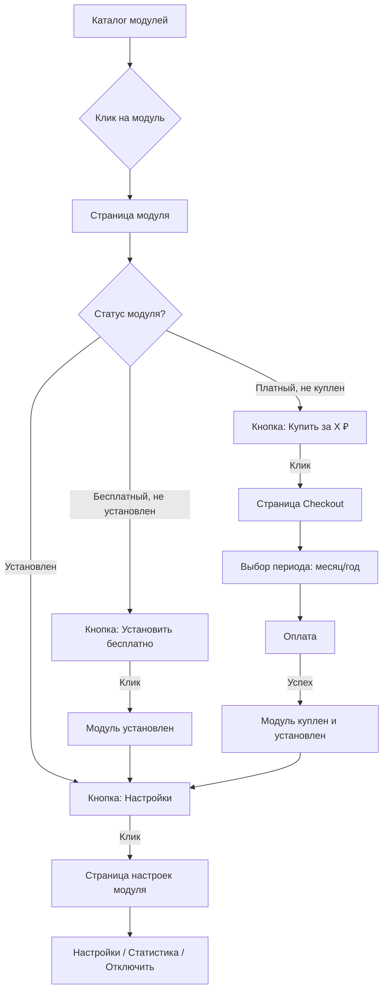

# Design Document: Module Marketplace Redesign

## Overview

Редизайн магазина приложений для создания качественного пользовательского опыта в стиле App Store / Google Play. Основные изменения:

1. **Разделение страниц**: Страница модуля в магазине (для просмотра/покупки) отделена от страницы настроек (для управления)
2. **Улучшенный UI**: Галерея скриншотов, отзывы, рейтинг, информационные блоки
3. **Процесс покупки**: Отдельная страница checkout с выбором периода подписки
4. **Чёткие статусы**: Визуальное отображение состояния модуля

## Architecture

```
┌─────────────────────────────────────────────────────────────────┐
│                     Module Marketplace                          │
├─────────────────────────────────────────────────────────────────┤
│  /app/modules              → Catalog.tsx (каталог)              │
│  /app/modules/{slug}       → Show.tsx (страница модуля)         │
│  /app/modules/{slug}/checkout → Checkout.tsx (покупка)          │
│  /app/modules/{slug}/settings → Settings.tsx (настройки)        │
│  /app/modules/my           → MyModules.tsx (мои приложения)     │
└─────────────────────────────────────────────────────────────────┘
```

### Потоки пользователя



## Components and Interfaces

### 1. ModulePurchaseController (Backend)

Обновлённые методы:

```php
class ModulePurchaseController extends Controller
{
    // Существующие методы
    public function catalog();      // GET /app/modules
    public function show($slug);    // GET /app/modules/{slug}
    public function enable($slug);  // POST /app/modules/{slug}/enable
    public function disable($slug); // POST /app/modules/{slug}/disable
    
    // Новые/обновлённые методы
    public function checkout($slug);           // GET /app/modules/{slug}/checkout
    public function processCheckout($slug);    // POST /app/modules/{slug}/checkout
    public function moduleSettings($slug);     // GET /app/modules/{slug}/settings
    public function saveModuleSettings($slug); // POST /app/modules/{slug}/settings
}
```

### 2. Frontend Pages

#### Catalog.tsx (обновление)
- Добавить фильтр по статусу (все / установленные / доступные)
- Улучшить карточки модулей с бейджами статуса

#### Show.tsx (редизайн)
```tsx
interface ModuleShowProps {
  module: Module;
  status: ModuleAccessStatus;
  reviews: ModuleReview[];
  relatedModules: Module[];
}

// Структура страницы:
// - Header: иконка, название, автор, рейтинг, установки
// - Screenshots Gallery: горизонтальный скролл
// - Description: полное описание с фичами
// - Reviews: отзывы пользователей
// - Sidebar: цена, кнопка действия, информация
```

#### Checkout.tsx (новая страница)
```tsx
interface CheckoutProps {
  module: Module;
  prices: {
    monthly: number;
    yearly: number;
    yearlyDiscount: number; // процент скидки
  };
}

// Структура:
// - Информация о модуле
// - Выбор периода (месяц/год) с ценами
// - Показ экономии при годовой подписке
// - Кнопка "Оплатить"
```

#### Settings.tsx (страница настроек модуля)
```tsx
interface ModuleSettingsProps {
  module: Module;
  settings: ModuleSettings;
  stats: ModuleStats | null;
  subscription: SubscriptionInfo | null;
}

// Структура:
// - Header с названием модуля
// - Статистика (если есть)
// - Настройки модуля
// - Информация о подписке (для платных)
// - Кнопка "Отключить модуль"
```

### 3. Компоненты UI

```tsx
// Новые компоненты
components/Modules/
├── ModuleCard.tsx          // Карточка в каталоге (обновить)
├── ModuleHeader.tsx        // Шапка страницы модуля
├── ScreenshotGallery.tsx   // Галерея скриншотов
├── ModuleReviews.tsx       // Секция отзывов
├── ModuleSidebar.tsx       // Сайдбар с ценой и действиями
├── ModuleInfo.tsx          // Блок информации
├── PeriodSelector.tsx      // Выбор периода подписки
├── ModuleStatusBadge.tsx   // Бейдж статуса
└── PurchaseDialog.tsx      // Диалог покупки (существует)
```

## Data Models

### Module (существующая модель)
```php
// Добавить поля если отсутствуют:
- yearly_price: decimal       // Цена за год
- yearly_discount: integer    // Процент скидки за год
- features: json              // Список фич для отображения
- changelog: json             // История изменений
```

### ModuleReview (новая модель)
```php
class ModuleReview extends Model
{
    protected $fillable = [
        'module_slug',
        'user_id',
        'rating',        // 1-5
        'comment',
        'is_verified',   // Проверенная покупка
    ];
}
```

## Correctness Properties

*A property is a characteristic or behavior that should hold true across all valid executions of a system-essentially, a formal statement about what the system should do. Properties serve as the bridge between human-readable specifications and machine-verifiable correctness guarantees.*

### Property 1: Module card displays all required fields
*For any* module in the catalog, the rendered card SHALL contain icon, name, description, rating, and price.
**Validates: Requirements 1.1**

### Property 2: Search filtering returns matching modules
*For any* search query and module list, all returned modules SHALL have name or description containing the search query (case-insensitive).
**Validates: Requirements 1.2**

### Property 3: Category filtering returns correct modules
*For any* category filter and module list, all returned modules SHALL belong to the selected category.
**Validates: Requirements 1.3**

### Property 4: Status badges display correctly
*For any* module, if it is installed then "Установлен" badge SHALL be shown, if it is featured then "Рекомендуем" badge SHALL be shown.
**Validates: Requirements 1.4, 1.5**

### Property 5: Action button matches module state
*For any* module on detail page:
- If free and not installed → "Установить бесплатно" button
- If paid and not purchased → "Купить за X ₽" button  
- If installed → "Настройки" button
**Validates: Requirements 2.6, 2.7, 2.8**

### Property 6: Module info block contains all fields
*For any* module on detail page, the info block SHALL contain version, author, category, and last update date.
**Validates: Requirements 2.9**

### Property 7: Yearly discount calculation
*For any* module with subscription pricing, yearly discount percentage SHALL equal ((monthly_price * 12 - yearly_price) / (monthly_price * 12)) * 100.
**Validates: Requirements 3.3**

### Property 8: Settings page access control
*For any* module, settings page SHALL only be accessible if module is installed (is_enabled = true).
**Validates: Requirements 4.1**

### Property 9: Subscription info display for paid modules
*For any* installed paid module, settings page SHALL display subscription expiry date and auto-renew status.
**Validates: Requirements 4.6**

### Property 10: Module status display
*For any* module, status SHALL correctly indicate one of: "Не установлен", "Установлен", "Требует оплаты", "Подписка истекает" based on module state.
**Validates: Requirements 6.1**

### Property 11: Expiring subscription warning
*For any* module with subscription expiring within 7 days, warning badge SHALL be displayed.
**Validates: Requirements 6.2**

### Property 12: My modules filter
*For any* user, "Мои приложения" tab SHALL show only modules where is_enabled = true for that user.
**Validates: Requirements 5.4**

## Error Handling

| Scenario | Error Message | Action |
|----------|---------------|--------|
| Module not found | "Модуль не найден" | Redirect to catalog |
| Settings access denied | "Модуль не установлен" | Redirect to module page |
| Payment failed | "Ошибка оплаты: {reason}" | Show retry button |
| Enable failed | "Не удалось включить модуль" | Show error toast |
| Disable failed | "Не удалось отключить модуль" | Show error toast |

## Testing Strategy

### Unit Tests
- Test search filtering logic
- Test category filtering logic
- Test status determination logic
- Test discount calculation
- Test access control for settings page

### Property-Based Tests
- Property 2: Search filtering (fast-check)
- Property 3: Category filtering (fast-check)
- Property 5: Action button state (fast-check)
- Property 7: Discount calculation (fast-check)
- Property 10: Status display (fast-check)

### Integration Tests
- Full purchase flow
- Module enable/disable flow
- Settings save/load flow

### Testing Framework
- Frontend: Vitest + React Testing Library + fast-check
- Backend: PHPUnit
